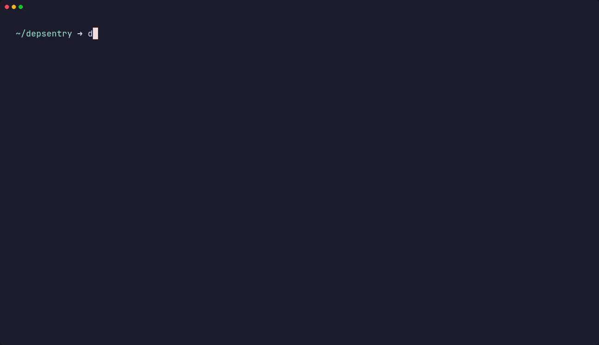

# 🛡️ DepSentry

[](https://www.rust-lang.org/)
[](https://github.com/Swek09/DepSentry/releases)
[](LICENSE)
[](https://mitre-attack.github.io/)

**DepSentry** is a fast Rust CLI for **proactive supply-chain security**.

Most tools stop at “does it have a CVE?”. DepSentry goes further: it **downloads packages to an ephemeral sandbox** and runs **static heuristics** (entropy/obfuscation, suspicious scripts, network indicators, etc.) **before** you install them.


> Static analysis in seconds. No execution. No install.

---

## ✨ What DepSentry does (today)

DepSentry has two “tracks”:

### 1) On-demand scanning
- `depsentry check` — scan **one package** (remote) or a **local directory**
- `depsentry scan` — scan **dependencies from a manifest** (basic parsing)

### 2) Continuous supervision
- `depsentry firewall ...` — a local daemon + project registry (stage 0)
  - start/stop/restart daemon
  - add/remove/list projects
  - status + logs

---

## 📥 Installation

### Option A: Download binaries (recommended)
Grab a prebuilt binary from Releases:
- Windows: `DepSentry-Installer-x64.msi`
- Ubuntu/Debian: `DepSentry-Linux-x64.deb`
- Linux (other): `DepSentry-Linux-x64.tar.gz`

### Option B: Build from source
```bash
git clone https://github.com/Swek09/DepSentry.git
cd DepSentry
cargo build --release
# binary: ./target/release/depsentry
````

---

## 🚀 Usage

### A) Check a single package (quality gate)

Use this when you want to vet one dependency quickly.

```bash
# Auto-detect ecosystem (NPM / PyPI) if possible
depsentry check axios

# Explicit ecosystem + version
depsentry check requests --type pypi --version 2.31.0

# Save JSON report (audit.json)
depsentry check axios --json
```

**Behavior**

* Prints a report for the package.
* Exits with **code 1** if **score < 50** (quality gate).

> Score is **0–100**. Higher is better. Lower means “more suspicious / more risk”.

---

### B) Scan a project manifest (audit without hard fail)

Use this in CI/CD to audit dependencies from a manifest.

```bash
depsentry scan --path ./package.json
# or
depsentry scan --path ./requirements.txt
```

**Behavior**

* Parses dependencies (basic parsing for now).
* Downloads each dependency and scans it.
* Prints a report **only if score < 80** (noise reduction).
* Does **not** “fail the build” by default (no hard exit gate in this mode yet).

---

### C) Firewall mode (daemon) — stage 0

```bash
# daemon lifecycle
depsentry firewall start
depsentry firewall stop
depsentry firewall restart

# project registry
depsentry firewall add ~/work/my-api
depsentry firewall ls
depsentry firewall status my-api
depsentry firewall logs my-api --lines 200
depsentry firewall rm my-api
depsentry firewall scan my-api --deep
depsentry firewall scan my-api --cve-only
depsentry firewall save
depsentry firewall resurrect
```

---

## 🔍 What is being checked (analysis engine)

DepSentry combines vulnerability lookups with static heuristics:

### Vulnerabilities (OSV)

* Queries OSV by `(ecosystem, name, version)` when network is available.
* If OSV/network is unavailable, the check is skipped (scan continues).

### Heuristics (static, no execution)

* **Typosquatting**: simple similarity (Levenshtein) vs a small popular list
* **Reputation**: flags very new releases (e.g., < 7 days old)
* **Entropy**: high-entropy blobs (packed/obfuscated content)
* **Suspicious patterns**: `eval/exec`
* **NPM lifecycle scripts**: suspicious install hooks in `package.json`
* **Network indicators**: hardcoded IPs / socket patterns (best-effort)

Everything runs in an **ephemeral sandbox directory**. DepSentry does **not** execute package code.

---

## 🧱 Architecture (high level)

DepSentry is organized as small modules called from the CLI:

* `cli.rs` — Clap command tree (`check`, `scan`, `firewall ...`)
* `ecosystem.rs` — NPM/PyPI detection and helpers
* `fetcher.rs` — registry metadata lookup, download, extraction (temp dir)
* `analysis.rs` — heuristics + OSV lookup + scoring
* `report.rs` — terminal table + optional `audit.json`
* `firewall.rs` — daemon + project registry + logs (stage 0)

---

## ⚖️ License

Copyright 2026 Mikhail Grishak.

Licensed under the **Apache License, Version 2.0** — see `LICENSE`.